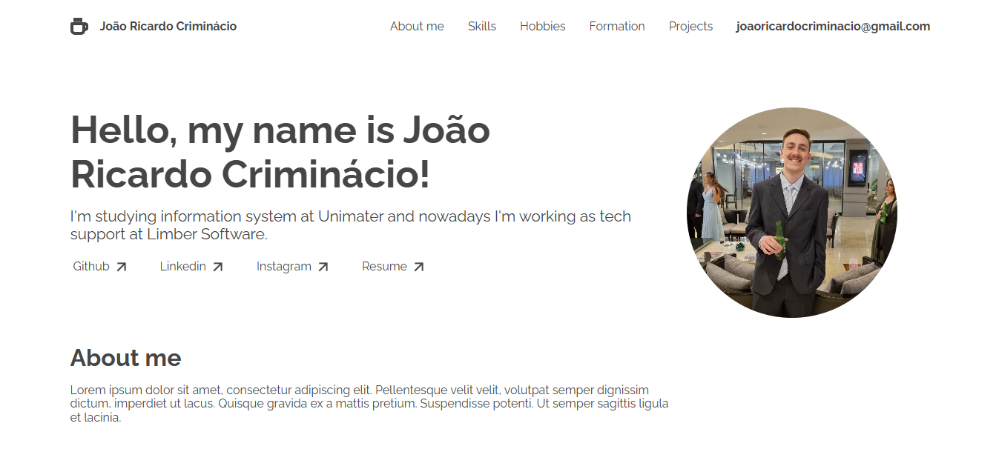

<h1 align="center"> Portfolio </h1>

Atividade final do curso Desenvolvimento de Aplicações para WEB da faculdade Unimater.

  

 

## 🚀 Tecnologias

Esse projeto foi desenvolvido com as seguintes tecnologias:

- HTML e CSS
- Git e Github

## 💻 Projeto

O projeto final da matéria de desenvolvimento web é um portfolio, utilizado para falar um pouco sobre mim e apresentar meus projetos.
